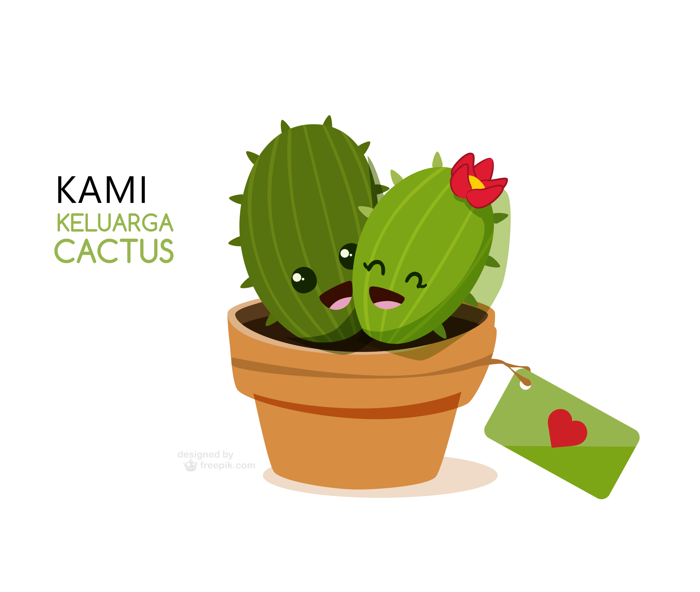

   

      

         

            

               <h2>Tentang Keluarga Cactus</h2>
            

         

      

   

   

   

      

         

            
         

         

            

               <h3 class="text-center">Hi, Selamat Datang di Keluarga Cactus!</h3>
               

               

                  Keluarga Cactus adalah Toko Kaktus Online yang menyediakan berbagai macam tanaman hias kaktus &amp; sukulen dengan kualitas terbaik. 
               

               

                  Tersedia 23 macam kaktus &amp; sukulen yang bisa dikirim ke seluruh Indonesia. Cocok untuk hadiah ulang tahun, kado wisuda, souvenir wedding dan koleksi pribadi. 
               

               

                  Because we love Cactus 
               

               

                   
                  
               

            

         

      

   

<!-- End brands area -->
